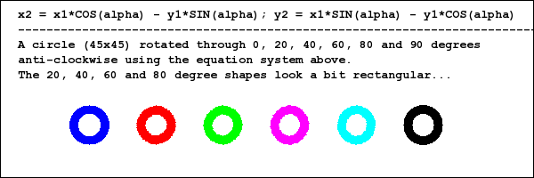

<h1>
	
	What was the problem?
	
</h1>

Drawing arcs in PHP can be difficult at times.  imagearc, imageellipse and their "filled" counterparts are okay if you just want an outlined shape or one that is totally filled, but that seems to be the limit. As of this writing they do not support thicknesses, and there is no facility to draw rotated shapes.

<h2>
	
	Usual Workarounds (you may have tried)
	
</h2>
There are some workarounds for these issues:
<ol>
	<li>
		You can partially solve the <strong>thickness</strong> issue by drawing two arcs for the outer and inner boundaries, connecting the ends and then using imagefilltoborder to flood the region with the desired colour.  This has some drawbacks:
		<ul>
			<li>
				The entire arc must fit on the screen for it to work smoothly. Otherwise you have to fill multiple points in order to ensure that the shape is filled correctly.
				 
				 
				
				 
				 
			</li>
			<li>
				The process fails if another shape of the same colour intersects the shape you want to fill. imagefilltoborder will only fill to the nearest border of the other shape.
				 
				 
				
				 
				 
			</li>
			<li>
				The process also does not work for alpha colours: imagefilltoborder fills the entire image with the colour because alpha colours blend with other pixels.
			</li>
		</ul>
	</li>
	<li>
		When drawing a <strong>rotated</strong> shape:
		<ul>
			<li>
				If you're really desperate you can use imagerotate, but that is overkill: you shouldn't rotate the entire image just because one arc in it needs to be rotated.
				 
				 
			</li>
			<li>
				You can bite the bullet and use the common formula for a rotated ellipse:
				<pre class="prettyprint">&nbsp; &nbsp; x2 = x1 <tt>*</tt> COS(alpha) - y1 <tt>*</tt> SIN(alpha) &nbsp; y2 = x1 <tt>*</tt> SIN(alpha) + y1 <tt>*</tt> COS(alpha) &nbsp; &nbsp;</pre>
				 
				Where point(x2,y2) is the result of rotating point (x1,y1) through angle alpha.
				 
				 
				The formula is sound but like many mathematically concepts, it is just too good for this sinful world, or at least our sinful screens. Shape boundary pixels are binary in a sense - a boundary pixel is not 60% or 40% covered by a shape: the shape either goes over the pixel or it doesn't. So an approximation has to be made when determining x1 and y1. Also, the approximations in SIN(alpha), COS(alpha) and the pixel approximations for (x2,y2) mean that the final pixels for the shape will probably not be where the mathematics expects. The effect is that sometimes the rotated shape looks like a rounded rectangle.
				 
				 
				This can be seen in a small rotated circle: in theory a circle should always look like a circle when rotated, but the result is sometimes a squarish shape:
				 
				 
				
				 
				 
				
				 
				 
</ol>

<h2>
	
	Introducing EllipseArc
	
</h2>

EllipseArc was created to address these problems:
<ol>
	<li>
		For <strong>thicknesses</strong>, it essentially draws horizontal lines between the inner and outer boundaries of the shape to simulate filling it. This automatically solves the problem of picking the correct pixel with imagefilltoborder AND the problem of intersecting shapes. An added bonus is that alpha colours are automatically supported: from EllipseArc's perspective they are no different from regular colours.
		 
		 
	</li>
	<li>
		For <strong>rotations</strong>, the trick was to find a reliable formula for the rotated points that minimises the amount of errors introduced by the pixel approximations. The equations above were not good enough, so I had to find another way.
		 
		 
  </li>
</ol>

Below are the equations EllipseArc uses:
		 
		
		 

		Where point(x2,y2) has angle phi and is the result of rotating point (x1,y1) through angle alpha. It is expressed in terms of the unrotated ellipse half-width "a", the half-height "b", the focus "f", the rotation angle "alpha" and the final angle "phi" of the desired point.
		

		

		Observe that this time the equation does not have any reference to x1 or y1. The only real "variable" in the equation is phi, so the calculations are alot more accurate.
		

		

		PS:In case you're wondering, I derived the formula above from first principles. It really is legit :-) Its complexity is probably why most people go with the earlier equations!
		

		

		Below are the rotated equivalent shapes EllipseArc produced for the small circle and ellipse above:
		 
		 
		
		 
		 
		
		 
		 
    Check out the examples to see how it works!

